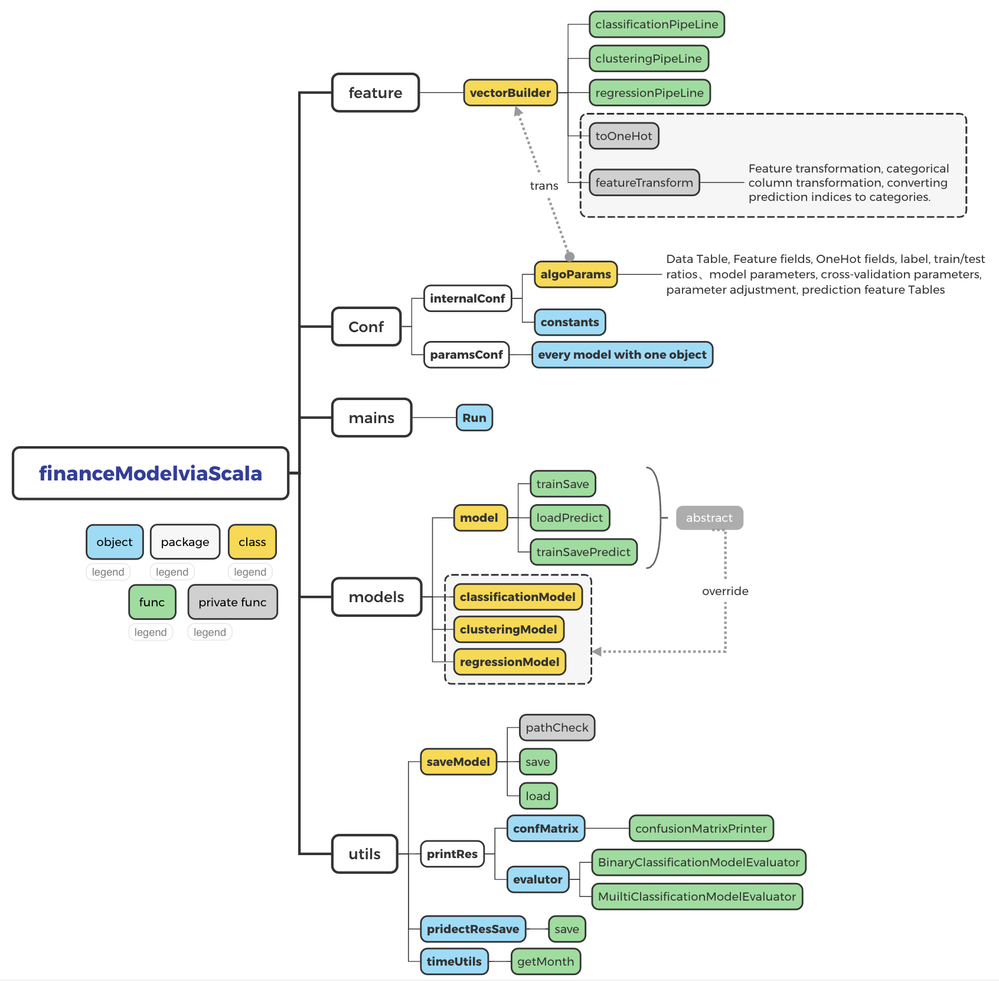

# FinanceMarketingDistributed 3.x
## Project Overview
FinanceMarketingDistributed is Scala-based distributed financial marketing application designed for processing and analyzing financial marketing data. This project uses Maven as the build tool and includes various modules and dependencies to support efficient distributed data processing.

## Functions
Distributed processing modules for financial marketing data
Compatibility with mainstream distributed frameworks (such as Hadoop or Spark) for large-scale data analysis
Multiple classes and methods tailored for specific business logic.

## License
This project is licensed under the MIT License.

